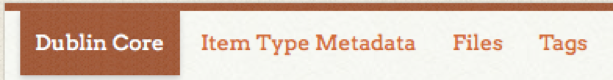
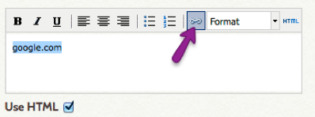

# Creating Items

##Digital Materials
Items are the fundamental building block for Omeka. For all other items use the steps here:

* Click “Items” on the left side of the admin interface
* Click the green “Add An Item” button.

Now it's time to describe your item by adding metadata. We'll work through all 4 available options from left to right. 

  
1. Dublin Core: Add information about your item according to your Project's Metadata Guide.
2. Item Type Metadata: Select the appropriate item type from the dropdown menu and fill in the relevant fields according to your Project's Metadata Guide.
3. Files: Click "browse" and upload the digital file(s) for your item. Omeka allows you to associate multiple files with a single item. 
4. Tags: Select appropriate tags according to your Project's Metadata Guide.

In the box on the right-hand side of the Files page, select an appropriate Collection for your item. Each item can be added to only one collection.

Note: If there are no collections listed in the dropdown box, you can create one in the “Collections” section if appropriate.

Finally, click “Add Item” and you’re done!

##Streaming Audiovisual Materials
* Create an image (screenshot, picture) to represent your item
* Click on “Items” on the left side of the admin interface
* Click the green “Add An Item” button

Now it's time to describe your item by adding metadata. We'll work through all 4 available options from left to right. 

* Dublin Core: Add information about your item according to your Project's Metadata Guide.
* Item Type Metadata: Select "Moving Image." A box called URL will appear. Click the “Use HTML” checkbox under this URL box. In the URL box, paste the URL where the audiovisual material can be found online. Click the icon that looks like a chain link. 

In the resulting dialog box, paste the same URL and give your link a descriptive title.
* Files: Click “browse” and select the screenshot or image that will represent this audiovisual material. Upload any additional digital file(s) for your item. Omeka allows you to associate multiple files with a single item. 
* Tags: Select appropriate tags according to your Project's Metadata Guide.

In the box on the right-hand side of the Files page, select an appropriate Collection for your item. Each item can be added to only one collection.

Note: If there are no collections listed in the dropdown box, you can create one in the “Collections” section if appropriate.

Finally, click “Add Item” and you’re done!